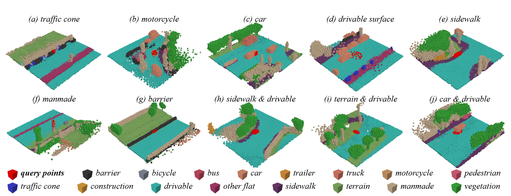
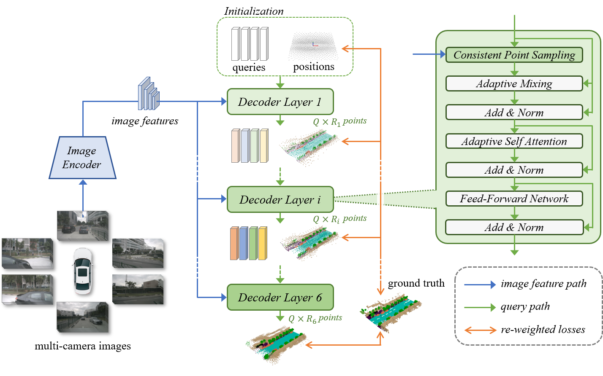

<div align="center">

# StreamOPUS: Streamimg Occupancy Prediction Using a Sparse Set (CVPR 2026)
</div>



> **OPUS: Occupancy Prediction Using a Saprse Set**
> - Authors: [Jiabao Wang*](https://jbwang1997.github.io/),
> [Zhaojiang Liu*](https://agito555.github.io/),
> [Qiang Meng](https://irvingmeng.github.io/), Liujiang Yan, Ke Wang,
> [Jie Yang](http://www.pami.sjtu.edu.cn/jieyang),
> [Wei Liu](http://www.pami.sjtu.edu.cn/weiliu),
> [Qibin Hou#](https://houqb.github.io/),
> [Ming-Ming Cheng](https://mmcheng.net/cmm/) \
> (* Equal contribition, # Corresponding author)
> - [Paper in arXiv](https://arxiv.org/pdf/2409.09350) | [知乎](https://zhuanlan.zhihu.com/p/721102233)

## News

- [2025/01/10]: We release the visualization code.
- [2024/09/26]: OPUS is accepeted by NeurIPS 2024 :rocket: :rocket: :rocket: .
- [2024/09/17]: We release an initial version of OPUS. It achieves promising performance of 41.2 RayIoU and 36.2 mIoU on the NuScene-Occ3D dataset.

## Abstract
Occupancy prediction, aiming at predicting the occupancy status within voxelized 3D environment, is quickly gaining momentum within the autonomous driving community.
Mainstream occupancy prediction works first discretize the 3D environment into voxels, then perform classification on such dense grids. However, inspection on sample data reveals that the vast majority of voxels is unoccupied. Performing classification on these empty voxels demands suboptimal computation resource allocation, and reducing such empty voxels necessitates complex algorithm designs.
To this end, we present a novel perspective on the occupancy prediction task: formulating it as a streamlined set prediction paradigm without the need for explicit space modeling or complex sparsification procedures.
Our proposed framework, called **OPUS**, utilizes a transformer encoder-decoder architecture to simultaneously predict occupied locations and classes using a set of learnable queries.
Firstly, we employ the Chamfer distance loss to scale the set-to-set comparison problem to unprecedented magnitudes, making training such model end-to-end a reality.
Subsequently, semantic classes are adaptively assigned using nearest neighbor search based on the learned locations.
In addition, OPUS incorporates a suite of non-trivial strategies to enhance model performance, including coarse-to-fine learning, consistent point sampling, and adaptive re-weighting, etc.
Finally, compared with current state-of-the-art methods, our lightest model achieves superior RayIoU on the Occ3D-nuScenes dataset at near $2\times$ FPS, while our heaviest model surpasses previous best results by 6.1 RayIoU. 

## Method



## Model Zoo

| Models                                          | Epochs |  *Q* | *P* | mIoU | RayIoU<sub>1m</sub> | RayIoU<sub>2m</sub> | RayIoU<sub>4m</sub> | RayIoU |  FPS | Link |
|:-----------------------------------------------:|:------:|:----:|:---:|:----:|:-------------------:|:-------------------:|:-------------------:|:------:|:----:|:----:|
| [OPUS-T](configs/opus-t_r50_704x256_8f_100e.py) |   100  | 600  | 128 | 33.2 |         31.7        |         39.2        |         44.3        |  38.4  | 22.4 | [Model](https://drive.google.com/file/d/10-dOpejD7gQMYY8aDhrWUXtAEIWO1KZr/view?usp=sharing) |
| [OPUS-S](configs/opus-s_r50_704x256_8f_100e.py) |   100  | 1200 | 64  | 34.2 |         32.6        |         39.9        |         44.7        |  39.1  | 20.7 | [Model](https://drive.google.com/file/d/1g1mkl3ij11wUQPDRjbftXw8cLd6lkBy7/view?usp=sharing) |
| [OPUS-M](configs/opus-m_r50_704x256_8f_100e.py) |   100  | 2400 | 32  | 35.6 |         33.7        |         41.1        |         46.0        |  40.3  | 13.4 | [Model](https://drive.google.com/file/d/1leXwavqWHP0JdkeprB5ynNH8IttHRkQk/view?usp=sharing) |
| [OPUS-L](configs/opus-l_r50_704x256_8f_100e.py) |   100  | 4800 | 16  | 36.2 |         34.7        |         42.1        |         46.7        |  41.2  |  7.2 | [Model](https://drive.google.com/file/d/17Ga2Uk1BPsLIq1tM1qxiK8LTX-GsKP39/view?usp=sharing) |

**note: *Q* denotes query numbers. *P* is the number of predicted points per query.**

## Training and Evaluation

### Environment

We build OPUS based on Pytorch 1.13.1 + CUDA 11.6
```
conda create -n opus python=3.8
conda activate opus
conda install pytorch==1.13.1 torchvision==0.14.1 pytorch-cuda=11.6 -c pytorch -c nvidia
```

Install other dependencies:

```
pip install openmim
mim install mmcv-full==1.6.0
mim install mmdet==2.28.2
mim install mmsegmentation==0.30.0
mim install mmdet3d==1.0.0rc6
```

Install turbojpeg and pillow-simd to speed up data loading (optional but important):

```
sudo apt-get update
sudo apt-get install -y libturbojpeg
pip install pyturbojpeg
pip uninstall pillow
pip install pillow-simd==9.0.0.post1
```

Compile CUDA extensions:

```
cd models/csrc
python setup.py build_ext --inplace
```

### Prepare Dataset

1. Download nuScenes from [https://www.nuscenes.org/nuscenes](https://www.nuscenes.org/nuscenes) and place it in folder `data/nuscenes`.

2. Download Occ3d-nuScenes from [https://tsinghua-mars-lab.github.io/Occ3D/](https://tsinghua-mars-lab.github.io/Occ3D/) and place it in `data/nuscenes/gts`

3. Prepare data with scripts provided by mmdet3d:

```
mim run mmdet3d create_data nuscenes --root-path ./data/nuscenes --out-dir ./data/nuscenes --extra-tag nuscenes
```

4. Perform data preparation for OPUS:

```
python gen_sweep_info.py
```

The final folder structure would be

```
data/nuscenes
├── maps
├── nuscenes_infos_test_sweep.pkl
├── nuscenes_infos_train_sweep.pkl
├── nuscenes_infos_train_mini_sweep.pkl
├── nuscenes_infos_val_sweep.pkl
├── nuscenes_infos_val_mini_sweep.pkl
├── samples
├── sweeps
├── v1.0-test
└── v1.0-trainval
```

Note: These `*.pkl` files can also be generated with our script: `gen_sweep_info.py`.

### Training

Download pre-trained [weights](https://download.openmmlab.com/mmdetection3d/v0.1.0_models/nuimages_semseg/cascade_mask_rcnn_r50_fpn_coco-20e_20e_nuim/cascade_mask_rcnn_r50_fpn_coco-20e_20e_nuim_20201009_124951-40963960.pth)
provided by mmdet3d, and put them in directory `pretrain/`:


```
pretrain
├── cascade_mask_rcnn_r101_fpn_1x_nuim_20201024_134804-45215b1e.pth
├── cascade_mask_rcnn_r50_fpn_coco-20e_20e_nuim_20201009_124951-40963960.pth
```

Train OPUS with a single GPU:

```
python train.py --config configs/opus-t_r50_704x256_8f_12e.py
```

Train OPUS with 8 GPUs:

```
bash dist_train.sh 8 configs/opus-t_r50_704x256_8f_12e.py
```

Note: The batch size for each GPU will be scaled automatically. So there is no need to modify the `batch_size` in configurations.

### Evaluation

Single-GPU evaluation:

```
export CUDA_VISIBLE_DEVICES=0
python val.py --config configs/opus-t_r50_704x256_8f_12e.py --weights path/to/checkpoints
```

Multi-GPU evaluation:

```
export CUDA_VISIBLE_DEVICES=0,1,2,3,4,5,6,7
torchrun --nproc_per_node 8 val.py --config configs/opus-t_r50_704x256_8f_12e.py --weights path/to/checkpoints
```

### Visualization

Visualizing results
```
python visualize.py --config configs/opus-t_r50_704x256_8f_12e.py --weights path/to/checkpoints
```

Visualizing inputs and ground-truths
```
python visualize.py --config configs/opus-t_r50_704x256_8f_12e.py --weights path/to/checkpoints --vis-input --vis-gt
```

## Bibtex

If this work is helpful for your research, please consider citing the following entry.

```
@inproceedings{wang2024opus,
  title={Opus: occupancy prediction using a sparse set},
  author={Wang, Jiabao and Liu, Zhaojiang and Meng, Qiang and Yan, Liujiang and Wang, Ke and Yang, Jie and Liu, Wei and Hou, Qibin and Cheng, Mingming}
  booktitle={Advances in Neural Information Processing Systems},
  year={2024}
}
```

## Ackknowledgement

Our code is developed on top of following open source codebase:

- [SparseBEV](https://github.com/MCG-NJU/SparseBEV)
- [SparseOcc](https://github.com/MCG-NJU/SparseOcc)

We sincerely appreciate their amazing works.

